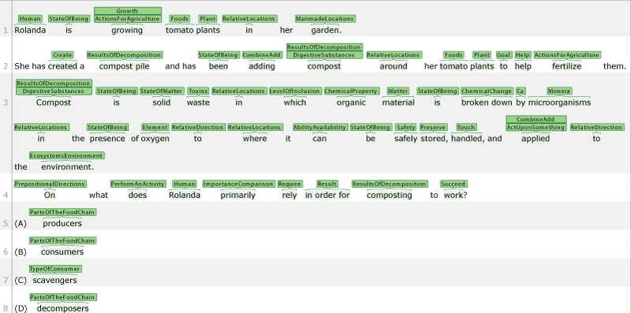

# Science Exam Common Entity Recognition (ScienceExamCER) code

# Introduction
---
This is a version of [Pytorch BERT-NER](https://github.com/kamalkraj/BERT-NER) modified to perform multilabel entity labeling for the Common Entity Recognition (CER) task in the paper: [ScienceExamCER: A High-Density Fine-Grained Science-Domain Corpus for Common Entity Recognition](https://arxiv.org/abs/1911.10436).

The aim of the common entity recognition task is to provide detailed fine-grained labels for nearly every word in text.  Below is an example:


For questions, comments, or issues, please e-mail pajansen@email.arizona.edu .

# Requirements
---
Software:
  * python 3.7
  * pip3 install -r requirements.txt
  * python3 -m spacy download en_core_web_sm

Hardware:
  * BERT requires a hefty GPU.  The minimum for BERT-Base is generally an RTX 2080 Ti with 11GB of memory.
  * Generally 20GB of system memory should be enough to tag even large plain text files.  The tagger automatically chunks large files and processes them one piece at a time, and includes a parameter, **--group_length**, that allows adjusting this up or down (default is tagging 1000 sentences at a time).  This is largely transparent to the user -- only one file is output.
# Usage
---

## Data

#### 2. Download ScienceExamCER data
```bash
$ wget http://www.cognitiveai.org/dist/ScienceExamCER_data.zip
$ unzip ScienceExamCER_data.zip
```
The train, validation (development), test, and ARC_test CoNLL format data will now be in the directory **/ScienceExamCER_data/conll_data/**. 

---
## Training
### Option 1: Train yourself
```bash
$ python run_ner.py --data_dir=ScienceExamCER_data/conll_data/ --bert_model=bert-base-cased --task_name=ner --output_dir=output_base --max_seq_length=64 --num_train_epochs 140 --do_train --do_eval --warmup_proportion=0.1
```
The output model and evaluation results on the development set (**eval_results.txt**) will be in the directory **/output_base/**.

### Option 2: Download pre-trained model
```bash
$ wget http://www.cognitiveai.org/dist/ScienceExamCER-Pretrained-Model.zip
$ unzip ScienceExamCER-Pretrained-Model.zip
```
The pre-trained model should now be in the directory **/output_base/**.

---
## Evaluation on ScienceExamCER test dataset
```bash
$ python run_ner.py --data_dir=ScienceExamCER_data/conll_data/ --bert_model=bert-base-cased --task_name=ner --output_dir=output_base --max_seq_length=64 --do_eval --do_eval_test --warmup_proportion=0.1
```
The test set evaluation results (**test_results.txt**) will be output in the directory **/output_base/** . The output will include precision, recall, and F1 performance per semantic class, as well as overall performance:

|                     |precision    |recall  |f1-score  | support |
| ------------------- |-------------|--------|----------|---------|
|  CelestialMovement   |  0.7931    |1.0000   | 0.8846   |     46 |
|UnderwaterEcosystem    | 0.7500    |0.8571   | 0.8000   |      7 |
|     RelativeNumber    | 0.8324    |0.8780   | 0.8546   |    164 |
|  ActionsForAnimals    | 0.8032    |0.8830   | 0.8412   |    171 |
|       StateOfBeing    | 0.9374    |0.9718   | 0.9543   |   1064 |
|          Negations    | 0.9516    |0.9593   | 0.9555   |    123 |
|           Minerals    | 0.9167    |0.7458   | 0.8224   |     59 |
|       RelativeTime    | 0.9048    |0.9280   | 0.9162   |    389 |
| ...                   | ...       | ...     | ...      | ...    |                                             
| TimeMeasuringTools    | 1.0000    |1.0000   | 1.0000    |     1 |
|            Vehicle    | 1.0000    |1.0000   | 1.0000    |     1 |
|      BusinessNames    | 0.0000    |0.0000   | 0.0000    |     1 |
|        avg / total    | 0.8479    |0.8625   | 0.8519    | 25374 |


---
## Using the model to tag ARC test set
```bash
$ python run_ner.py --data_dir=ScienceExamCER_data/conll_data/ --bert_model=bert-base-cased --task_name=ner --output_dir=output_base --max_seq_length=64 --do_eval --do_eval_ARCtest --warmup_proportion=0.1
```
The ARC test output (**ARC_test.conlloutput.txt, ARC_test.jsonoutput.json**) will be in the **/output_base** folder. 

---
## Tagging your own json text dataset
```bash
$ python run_ner.py --bert_model=bert-base-cased --task_name=ner --output_dir=output_base --max_seq_length=64 --do_eval --do_eval_json_text --json_text=myfile.json --warmup_proportion=0.1
```
The predicted tags will be output in the **/output_base** folder in two formats, CoNLL and JSON (**myfile.conlloutput.txt** , **myfile.jsonoutput.json**).

---
## Tagging your own plain text dataset
```bash
$ python run_ner.py --data_dir=ScienceExamCER_data/conll_data/ --bert_model=bert-base-cased --task_name=ner --output_dir=output_base --max_seq_length=64 --do_eval --do_eval_plain_text --plain_text=myfile.txt --warmup_proportion=0.1
```
The predicted tags will be output in the **/output_base** folder in two formats, CoNLL and JSON (**myfile.conlloutput.txt** , **myfile.jsonoutput.json**).

Example output is as follows (note that the semantic class may include more than one predicted label):

| Token    | Semantic Class |
| -------- | -------- |
| Jennifer	| B-PERSON | 
| measured	| B-Examine B-Measurements | 
| air	| B-Pressure | 
| temperature	| B-Temperature | 
| and	| O | 
| air	| B-Pressure | 
| pressure	| I-Pressure | 
| outside	| B-RelativeLocations | 
| her	| O | 
| house	| B-ManmadeLocations | 
| at	| B-RelativeTime | 
| noon	| B-TimesOfDayDayNight | 
| for	| O | 
| five	| B-CardinalNumber | 
| days	| B-TimeUnit | 
| .	| O | 
---

## Known Issues

#### 1. Maximum sequence length set too low. 
If you receive an error such as the following:
```
Traceback (most recent call last): 
 File "run_ner.py", line 780, in <module> 
   main() 
 File "run_ner.py", line 761, in main 
   base_filename) 
 File "/home/peter/github/scienceexam-ner-code/printOutput.py", line 33, in token_predition_write 
   if y_pred[idx][tokenid] == []: 
IndexError: list index out of range
```

It is likely that your dataset includes sentences that are greater than the current maximum sequence length.  The recommended fix is increasing your sequence length setting, for example, **—max_seq_length=128** .


